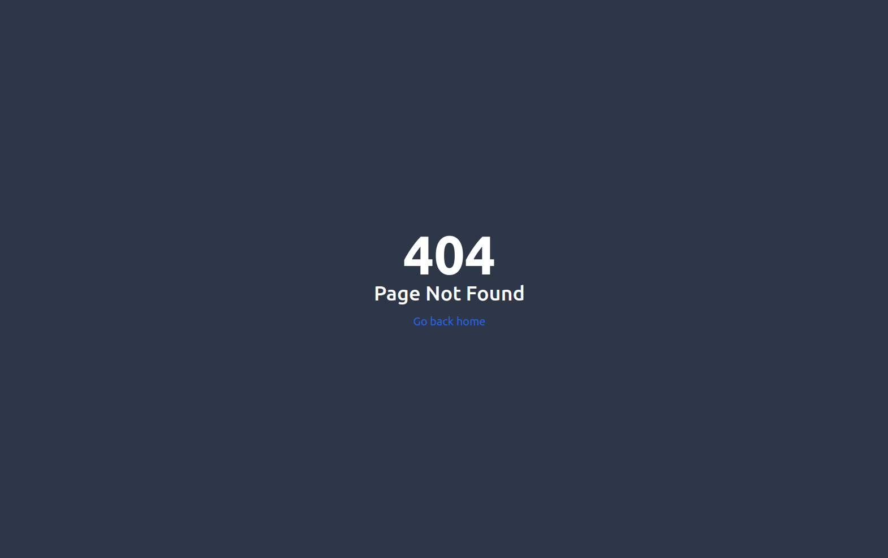

<br />
<p align="center"></p>

# Nasty Comics
#### This is a web based application which let users use Image generation AI in the backend to create comic book pages by passing prompts and sharing/downloading the generated page.

## Live Demo
#### This project is deployed on Netlify which you can view at [Nasty Comics Website](https://stacklimit-community-qna-platform.onrender.com/).

## 🧩 Main Features
#### <ul><li>Minimalistic & Responsive UI</li><li>Comic strip generation using text-to-image API</li><li>Share & Download your created comic page</li>

## 📖 Pages
#### <ul><li>Home Page</li><li>Comic Creation Page</li><li>404 Not Found Page</li></ul>

## 💻 TechStack Used
#### <ul><li>React.js</li><li>Tailwind CSS</li><li>Vite</li></ul>

## Prerequisites
#### Node.js should be installed on your system as npm would be required.
#### <ul><li>[Node.js](https://nodejs.org/en/)</li></ul>

## 🎪 Getting Started
<ul><li>In the root of project folder run : npm run dev</li><li>Server should have started and headover to "http://localhost:5173" to see the project working live 🙌.</li></ul>

# 🖼️ Some glimpse of the website

## Home Page

<br />

## Create Comic Page

<br />

## 404 Error Page

<br />
<br />

# 🐛 Bug Reporting
#### Feel free to [open an issue](https://github.com/Kunalpal216/Dashtoon-Product-Assignment/issues) on GitHub if you find any bug.

<br />

# ⭐ Feature Suggestion
#### Feel free to [open an issue](https://github.com/Kunalpal216/Dashtoon-Product-Assignment/issues) on GitHub if you have feature idea to be added 🙌.

```
Thanks for visiting my repository 😊!! Please give a star ⭐ if you liked my project.
```